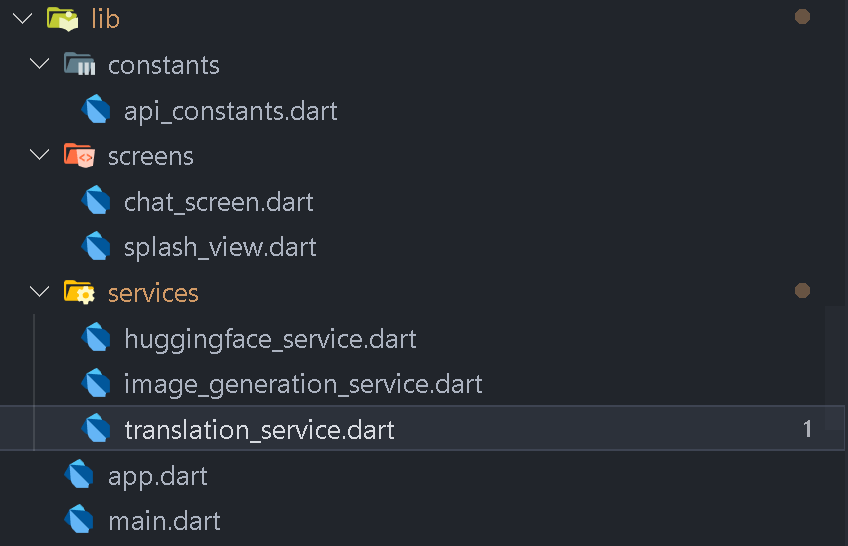

# 🤖 Image Generator AI

## 🚀 Getting Started

Description:
This is an innovative AI-powered application designed to generate digital representations of Egyptian Orthodox Christian icons. The app aims to preserve the sacredness of Coptic saints and honor the Orthodox traditions, while utilizing modern tools to assist artists, clergy, and believers in visualizing holy images.

Features:
🎨 Generate icons of saints based on Coptic Orthodox style and tradition.

🌐 Uses MyMemory Translation API to translate the user’s prompt from Arabic (or other languages) into English.

🤖 Integrates a lightweight AI image generation model hosted on Hugging Face.

📤 Sends the resulting AI-generated image to the user.

🛑 The app is currently lightweight and free, and the AI model lacks proper training, so the results are not highly accurate or refined yet.

## 🤳 Screens

- **Splash Screen:** . 
- **AI page** .


## 📁 File Structure




## 🖼️ Images for UI


## ☢️ Usage

1. **Clone the repository**

2. **Open the project in your preferred Flutter IDE.**

3. **Explore the `lib` directory:**

    - Review the project structure to understand the core of the app.
    - Customize the app of your need.

4. **Run the app on an emulator or physical device:**

    ```bash
    flutter run
    ```

## 🚨 Contributing

- Contributions are welcome 💜
- If you encounter any issues or have suggestions for improvements, please open an issue or submit a pull request.
